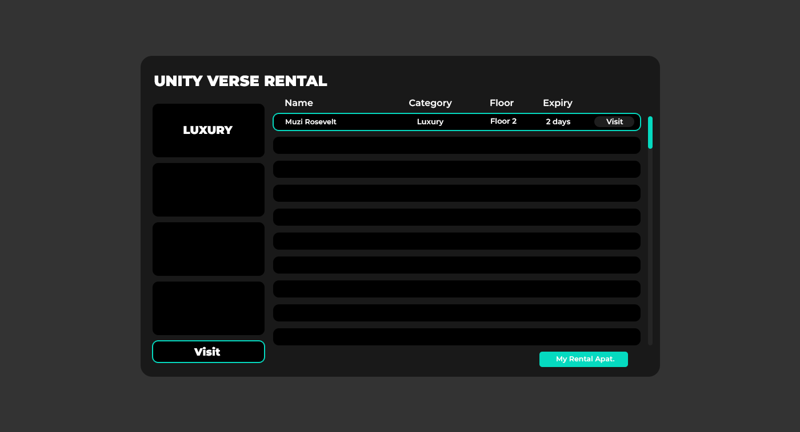

# UI Design for FiceM Rental Service

This repository contains a UI design specifically created for the FiceM Rental Service. The design aims to provide an intuitive and user-friendly interface for users to navigate through the rental service platform. The UI is clean, modern, and responsive, ensuring a great experience for the users.

## Features

- **HTML and CSS-based UI Design**: The design is implemented using HTML for structure and CSS for styling.
- **Responsive Design**: The UI is designed to adapt to different screen sizes, ensuring compatibility across devices.
- **Two main images showcasing the UI elements and design**.
- **Customizable Elements**: Easily modify the components to fit the branding and needs of FiceM Rental Service.

## Images

Below are the images showcasing the UI design:

### Image 1: Overview of the UI


### Image 2: Detailed view of rental options



## Technologies Used

- **HTML**: For the structure of the UI design.
- **CSS**: For styling the UI and ensuring responsiveness across different devices.

## Installation

To use or customize this UI design, simply clone or download the repository and integrate the files into your project:

```bash
git clone https://github.com/your-username/repository-name.git
````

